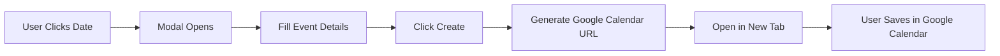

# 🗓️ Clario Calendar - Google Calendar Integration

A seamless calendar integration for the Clario platform that allows users to create events directly from the web interface and sync them to their Google Calendar.


## 📋 Table of Contents

- [Features](#features)
- [Demo](#demo)
- [Tech Stack](#tech-stack)
- [Prerequisites](#prerequisites)
- [Installation](#installation)
- [Configuration](#configuration)
- [Usage](#usage)
- [Project Structure](#project-structure)
- [How It Works](#how-it-works)
- [Contributing](#contributing)
- [License](#license)
- [Team](#team)

## ✨ Features

- 🎯 **One-Click Event Creation** - Create calendar events directly from the Clario interface
- 📅 **Google Calendar Integration** - Events open in Google Calendar for instant saving
- 🌓 **Dark/Light Mode** - Automatic theme adaptation based on device preferences
- 📱 **Responsive Design** - Works seamlessly on desktop, tablet, and mobile devices
- 🎨 **Clean UI** - Intuitive interface matching Clario's design language
- 🚀 **No Authentication Required** - Direct calendar link generation (Unstop-style)
- ⚡ **Fast & Lightweight** - Minimal dependencies, maximum performance

## 🎥 Demo


### Live Demo
[View Live Demo](https://clario-calendar.vercel.app)

## 🛠️ Tech Stack

- **Framework**: [Next.js 14+](https://nextjs.org/) (App Router)
- **Language**: [TypeScript](https://www.typescriptlang.org/)
- **Styling**: CSS Variables (Custom Dark/Light Theme)
- **Calendar Integration**: Google Calendar API (Link Generation)
- **Package Manager**: pnpm
- **Deployment**: Vercel

## 📦 Prerequisites

Before you begin, ensure you have the following installed:

- Node.js 18+ ([Download](https://nodejs.org/))
- pnpm 8+ ([Installation Guide](https://pnpm.io/installation))
- A modern web browser (Chrome, Firefox, Safari, Edge)

## 🚀 Installation

### 1. Clone the Repository
```bash
git clone https://github.com/YOUR_USERNAME/clario-calendar-integration.git
cd clario-calendar-integration
```

### 2. Install Dependencies
```bash
pnpm install
```

### 3. Run Development Server
```bash
pnpm dev
```

Open [http://localhost:3000](http://localhost:3000) in your browser.

## ⚙️ Configuration

### Environment Variables (Optional)

If you plan to use NextAuth for advanced features, create a `.env.local` file:
```env
# Optional - Only needed for OAuth authentication
GOOGLE_CLIENT_ID=your_client_id_here
GOOGLE_CLIENT_SECRET=your_client_secret_here
NEXTAUTH_SECRET=your_secret_here
NEXTAUTH_URL=http://localhost:3000
```

> **Note**: The current implementation uses direct Google Calendar links and doesn't require authentication. OAuth setup is only needed for advanced features.

### Dark/Light Mode

The app automatically detects your system theme preference. To customize:

Edit `app/globals.css`:
```css
:root {
  --background: #ffffff;
  --foreground: #171717;
  /* ... other variables */
}

@media (prefers-color-scheme: dark) {
  :root {
    --background: #0a0a0a;
    --foreground: #ededed;
    /* ... dark theme variables */
  }
}
```

## 📖 Usage

### Creating an Event

1. **Navigate to Calendar Page**
   - Click on "Calendar" in the sidebar

2. **Create Event**
   - Click the **"+ Create Event"** button, OR
   - Click on any date in the calendar

3. **Fill Event Details**
   - **Event Title**: Enter your event name
   - **Start Time**: Select date and time
   - **End Time**: Select date and time

4. **Save to Google Calendar**
   - Click **"Create"** button
   - Google Calendar opens in a new tab with your event pre-filled
   - Click **"Save"** in Google Calendar

### Use Cases for Clario Users

#### 🎓 Mentorship Sessions
```typescript
// Schedule 1:1 sessions with industry mentors
Title: "1:1 Career Guidance with John Doe"
Start: Tomorrow at 2:00 PM
End: Tomorrow at 3:00 PM
```

#### 📚 Study Schedule
```typescript
// Plan your learning milestones
Title: "Complete React.js Module"
Start: Oct 25, 2025 at 9:00 AM
End: Oct 25, 2025 at 5:00 PM
```

#### 💼 Job Application Deadlines
```typescript
// Track application deadlines
Title: "Apply to Google SDE Intern"
Start: Oct 30, 2025 at 11:59 PM
End: Oct 30, 2025 at 11:59 PM
```

#### 🎯 Roadmap Goals
```typescript
// Set career milestone deadlines
Title: "Complete Data Structures Course"
Start: Nov 15, 2025
End: Nov 15, 2025
```

## 🔧 How It Works

### Event Creation Flow


### Google Calendar Link Generation

The app generates a Google Calendar URL using the following format:
```typescript
https://calendar.google.com/calendar/render?
  action=TEMPLATE
  &text=Event+Title
  &dates=20251019T140000Z/20251019T150000Z
  &details=Event+Description
  &location=Event+Location
```

### Key Components

#### 1. **CalendarEventModal** (`components/CalendarEventModal.tsx`)
- Displays the event creation form
- Validates user input
- Generates Google Calendar link
- Opens link in new tab

#### 2. **calendar-utils.ts** (`lib/calendar-utils.ts`)
- `openGoogleCalendarEvent()`: Generates and opens Google Calendar URL
- `createGoogleCalendarLink()`: Returns calendar URL as string
- Date formatting utilities

#### 3. **Calendar Page** (`app/page.tsx`)
- Main calendar interface
- Date selection
- Event creation trigger
- Clario sidebar integration

## 🎨 Customization

### Change Button Colors

Edit button styles in `app/page.tsx`:
```typescript
style={{
  backgroundColor: '#4285f4', // Change to your brand color
  color: 'white',
  // ... other styles
}}
```

### Customize Modal Design

Edit modal styles in `components/CalendarEventModal.tsx`:
```typescript
const modalContentStyle: React.CSSProperties = {
  backgroundColor: 'white',
  borderRadius: '12px',
  padding: '30px',
  // ... customize here
};
```

### Add Custom Fields

Add new fields to the event form:
```typescript
const [formData, setFormData] = useState({
  title: '',
  startTime: new Date(),
  endTime: new Date(),
  location: '', // Add location field
  description: '', // Add description field
});
```

## 🤝 Contributing

Contributions are welcome! Please follow these steps:

1. **Fork the Repository**
```bash
   git clone https://github.com/YOUR_USERNAME/clario-calendar-integration.git
```

2. **Create a Feature Branch**
```bash
   git checkout -b feature/AmazingFeature
```

3. **Commit Your Changes**
```bash
   git commit -m 'Add some AmazingFeature'
```

4. **Push to the Branch**
```bash
   git push origin feature/AmazingFeature
```

5. **Open a Pull Request**

### Coding Standards

- Use TypeScript for type safety
- Follow ESLint rules
- Write meaningful commit messages
- Add comments for complex logic
- Test on multiple browsers

## 🐛 Known Issues

- Safari may block popup windows (user needs to allow popups)
- Date/time format varies by browser locale
- Requires internet connection for Google Calendar redirect

## 🔮 Future Enhancements

- [ ] Add event templates (Mentorship, Study, Job Application)
- [ ] Recurring events support
- [ ] Event color customization
- [ ] iCal/Outlook calendar support
- [ ] Event reminders configuration
- [ ] Bulk event creation
- [ ] Calendar view (Month/Week/Day/Agenda)
- [ ] Event search and filters

## 📄 License

This project is licensed under the MIT License - see the [LICENSE](LICENSE) file for details.

## 👥 Team
 BE Computer Engineering, 2nd Year
 **Riteshkumar Lalankumar Sinha** - 241230107056 

## 🙏 Acknowledgments

- [Next.js Documentation](https://nextjs.org/docs)
- [Google Calendar API](https://developers.google.com/calendar)
- [Unstop](https://unstop.com) - Inspiration for calendar integration
- Clario Platform Team

## 📞 Contact

**Project Link**: [https://github.com/YOUR_USERNAME/clario-calendar-integration](https://github.com/ritesh-sinha29/clario-calendar-integration)

**Clario Platform**: [Your Website URL]

---

<div align="center">
  <p>Made with ❤️ by Team Clario</p>
  <p>
    <a href="#-table-of-contents">Back to Top ⬆️</a>
  </p>
</div>

🎯 Quick Setup Guide (Optional - Add to docs/)
Create a docs/SETUP.md file:
markdown# Quick Setup Guide

## For Developers

### 1. Clone & Install
```bash
git clone https://github.com/YOUR_USERNAME/clario-calendar-integration.git
cd clario-calendar-integration
pnpm install
pnpm dev
```

### 2. Test Event Creation
1. Go to http://localhost:3000
2. Click any date or "Create Event"
3. Fill in event details
4. Click "Create"
5. Verify Google Calendar opens

### 3. Deploy to Vercel
```bash
vercel --prod
```

## For Non-Technical Users

### How to Use
1. Visit the Clario Calendar page
2. Click on any date you want to create an event
3. Fill in:
   - Event name (e.g., "Team Meeting")
   - Start time
   - End time
4. Click "Create"
5. Google Calendar opens - click "Save"
6. Done! ✅
- **Popup blocked?** Allow popups for this site
- **Wrong time?** Check your device timezone settings
- **Event not saving?** Make sure you click "Save" in Google Calendar
